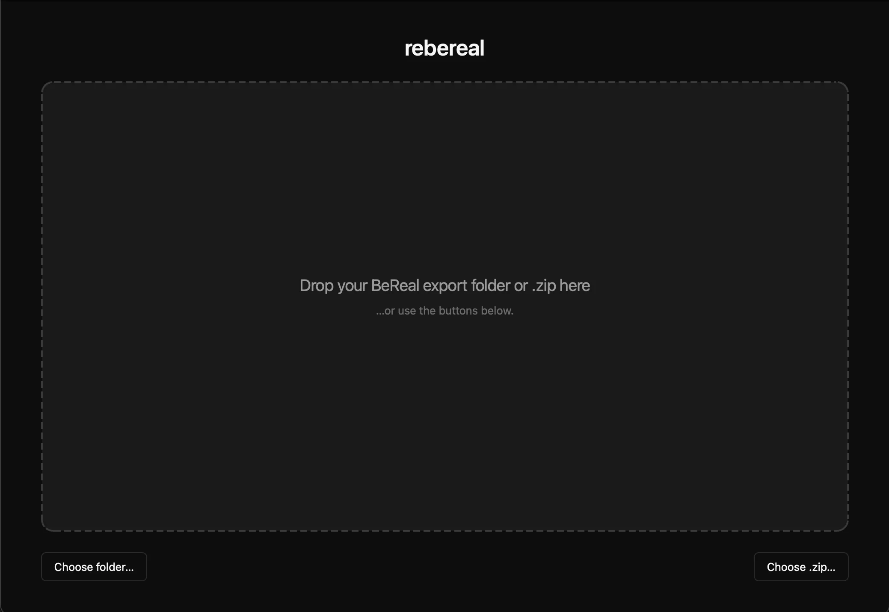
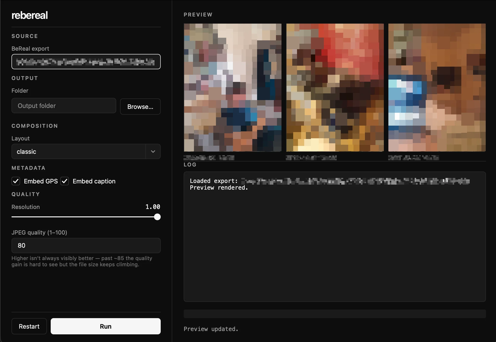

# reBeReal

Reconstruct importable photos from a BeReal data export.

reBeReal reads a BeReal export folder (`posts.json` + `Photos/`), composes each
post back into the classic BeReal look (back-camera frame + front-camera inset),
stamps each output with EXIF (date + GPS), XMP, and IPTC metadata, and writes
one JPEG per post organised by year.

The caption is written via XMP `dc:description` and IPTC `Caption-Abstract`
(the two channels Apple Photos and Google Photos actually read). GPS is
written as standard EXIF GPS tags and is only present for posts whose
`posts.json` entry has a `location` field.



## Install

The recommended setup is a dedicated conda environment, then an editable install
with the GUI extra:

```
conda create -n rebereal python=3.12
conda activate rebereal
pip install -e ".[dev,gui]"
```

## Usage

### GUI

```
python main.py
```

The app opens on a landing screen: drop your BeReal export **folder or `.zip`**
onto the drop zone (or use **Choose folder… / Choose .zip…**). A zip is
extracted in the background with a progress bar. Once it loads, the working UI
appears and three sample composites preview automatically, re-rendering when you
change the layout, resolution, or JPEG quality. Pick an **output folder** and
click **Run** to process the full export. **Restart** returns to the landing
screen to load a different export.



### CLI

```
python -m rebereal --export ./Data --output ./Output
```

Useful flags: `--layout classic`, `--no-gps`, `--no-caption`, `-v`.

`classic` (the BeReal-style back-camera frame with the front-camera inset) is the
only layout implemented for now. Other variants — side-by-side, separate files per
post, and classic-plus-originals — are planned and slot into the `layouts/` plugin
registry without touching the orchestrator.

Output quality:

- `--resolution` — output size as a fraction of source, `0.01`–`1.0`; keeps
  aspect ratio (default `1.0` = full source resolution).
- `--jpeg-quality` — JPEG quality `1`–`100` (default `80`). Higher isn't always
  visibly better: past ~85 the quality gain is hard to see but the file size
  keeps climbing.

Both controls are also available in the GUI.

## Tests

```
pytest -q
```

## Layout

- `src/rebereal/` — core library (headless; no GUI import).
- `src/rebereal/gui/` — Qt (PySide6) wrapper; imports core, never the reverse.
- `tests/` — pytest scaffold.

Strategy plugins live under `layouts/`, `parsers/`, `metadata/`, and `naming/`;
new variants drop in without touching the orchestrator.
